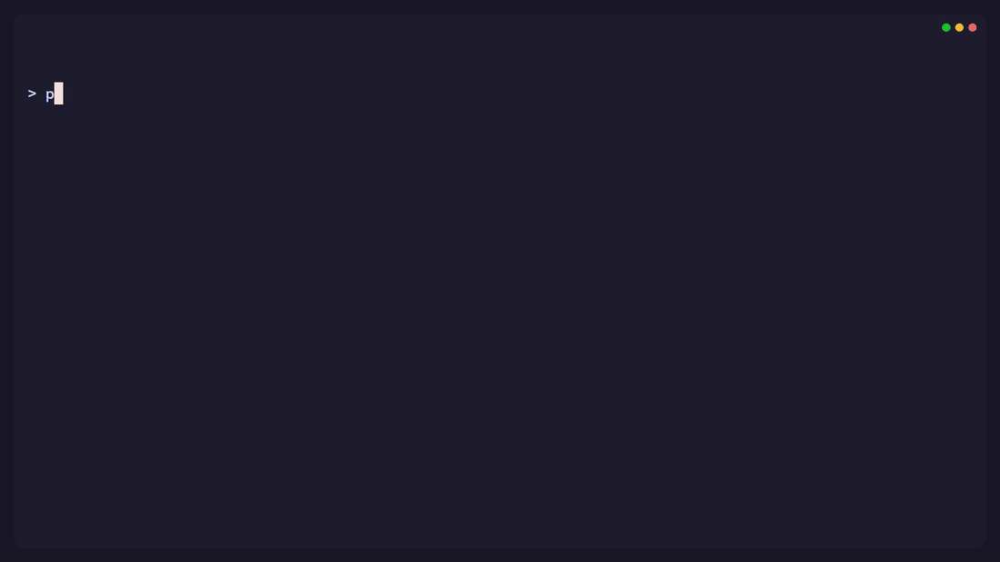

# PromptG CLI

[](LICENSE)
[](https://www.npmjs.com/package/@promptg/cli)
[](https://github.com/promptg/cli/actions/workflows/ci.yml)

### Prompts as code. Versioned, shareable, standard.

_PromptG CLI is LLM and tool agnostic. It manages prompts and prompt templates locally (“prompt-as-code”) and outputs plain text so you can pipe it into any runner or copy it anywhere._




 
_Prompts and Prompt Templates are standardised JSON files that live in your user .promptg folder, or projects (or anywhere really). They can be created, imported and exported, or compiled into packs and shared._

## Installation

```bash
npm install -g @promptg/cli
promptg --help
```

## Quickstart

```bash
# Create a project store in the current repo (./promptg)
promptg init

# Save a prompt from stdin (the prompt content can use {{variables}})
echo "Hello, this is my sample prompt" | promptg prompt save hello

#or create in your editor
promptg prompt new hello

# Render your prompt
promptg get hello

# Pipe it into your runner:
# promptg get hello | <your-llm-runner>
```

#### Variable substitution

```bash
# Save a prompt from stdin (the prompt content can use {{variables}})
echo "Review this code, focus on {{focus}}." | promptg prompt save review

# Render it with variables
promptg get review --var focus=Security
```
#### Quick install packs
```bash
promptg pack install https://promptg.io/dl/packs/promptg-pack-dev-essentials.json
```
See the [PromptG Starter Packs](https://github.com/promptg/starter-packs) repository for more

#### Common commands

See the full CLI reference: [docs/CLI.md](docs/CLI.md), or some quick commands below

```bash
# Discover + debug
promptg --help
promptg status
promptg store path --store project
promptg doctor
promptg version

# List and inspect what you have
promptg prompt list --long
promptg template list --long
promptg prompt show code-review
promptg template show pr-review --embedded

# Edit metadata (description/tags) and rename
promptg prompt meta code-review --description "Review a diff for security issues" --tag security --tag review
promptg prompt rename code-review security-review

# Render prompt different ways
promptg get pr-review --unfilled
promptg get pr-review --info
promptg get pr-review --format json

# Import JSON (backup/share)
promptg import ./promptg-prompt-hello.json

# Packs: build + install
promptg pack build my-team-pack --pack-version 1.0.0 --store project
promptg pack install ./.promptg/packs/promptg-pack-my-team-pack.json --only-new

# CI checks
promptg validate
```

## Prompts, Templates, Packs - The PromptG ecosystem

PromptG defines three fundamental document kinds. [Complete info](https://github.com/promptg/spec/blob/main/spec/promptg-spec.md#2-core-concepts-and-rationale-informative).

### Prompt

A Prompt is the atomic, executable unit in PromptG. It represents a single, self-contained, ready-to-use instruction for an AI model, containing the prompt text, optional variables, and metadata.

```json
{
  "schemaVersion": "1",
  "kind": "prompt",
  "name": "welcome",
  "content": "Write a short welcome message for {{name}}."
}
```

### Template

A Template is a catalog or distribution envelope for a single, complete embedded Prompt document. It contains a full Prompt document under its prompt field. The Template itself has its own metadata for discovery and organization, which is entirely separate from the embedded Prompt.

```json
{
  "schemaVersion": "1",
  "kind": "template",
  "name": "welcome",
  "displayName": "Welcome message",
  "description": "Greets a person by name",
  "prompt": {
      "schemaVersion": "1",
      "kind": "prompt",
      "name": "welcome",
      "content": "Write a short welcome message for {{name}}."
   }
}
```

### Pack

A Pack is a versioned collection that bundles multiple Prompt and/or Template documents.

```json
{
  "kind": "pack",
  "name": "my project onboarding",
  "version": "1.1.4",
  "prompts": [{ "name": "welcome", "content": "..." }],
  "templates": [{...},{...}],
  "prompts": [{...},{...},{...}]
}
```
## `.promptg/` Folder Layout

When you run `promptg init`, it creates a project store at `.promptg/` with this structure:

```
.promptg/
|---- prompts/                 # Prompt documents (instances)
|   `---- promptg-prompt-<name>.json
|---- templates/               # Template documents (blueprints)
|   `---- promptg-template-<name>.json
`---- packs/                   # Pack documents (distribution bundles)
    `---- promptg-pack-<name>.json
```
## Documentation

- Full CLI reference: [docs/CLI.md](docs/CLI.md)
- Schemas (vendored for offline use + editor tooling): [schemas/README.md](schemas/README.md)
- Spec: https://github.com/promptg/spec

## Contributing

See [CONTRIBUTING.md](CONTRIBUTING.md)

## Security

See [SECURITY.md](SECURITY.md).

## License

Apache-2.0. See [LICENSE](LICENSE).
